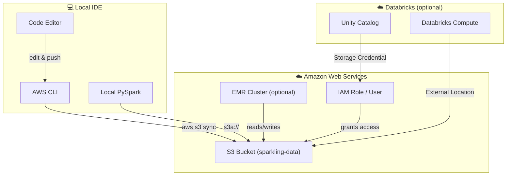

# ☁️ AWS S3 Setup Guide for Spark-ling

Connect the Spark-ling project to AWS S3 for cloud data storage.

---

## Architecture



---

## Quick Setup

### 1. Prerequisites

```bash
# Install AWS CLI
curl "https://awscli.amazonaws.com/awscli-exe-linux-x86_64.zip" -o "awscliv2.zip"
unzip awscliv2.zip && sudo ./aws/install

# Configure credentials
aws configure
# → Enter Access Key ID, Secret Access Key, Region (ap-southeast-1)

# Verify
aws sts get-caller-identity
```

### 2. Create S3 Bucket

```bash
# Copy config template
cp aws/.env.example aws/.env
# Edit aws/.env → fill in AWS_ACCOUNT_ID, AWS_REGION, S3_BUCKET

# Run setup script
./aws/setup_s3.sh
```

### 3. Generate & Upload Data

**Option A: Generate on Databricks → S3** (recommended)

Run the generator on Databricks serverless compute — data writes directly to S3:

```python
# In a Databricks notebook:
%run /Repos/your-user/Spark-ling/scripts/generate_to_s3
```

Or import and run `scripts/generate_to_s3.py` as a Databricks job.

**Option B: Generate locally → sync to S3**

```bash
python src/data_generator.py       # generates CSV to data/raw/
./aws/sync_data.sh upload          # syncs to S3
./aws/sync_data.sh status          # verify
```

### 4. Use in Code

```python
from configs.spark_config import get_spark_session, get_data_path

# Explicit AWS mode
spark = get_spark_session("MyApp", mode="aws")
raw = get_data_path("raw", mode="aws")  # → s3a://your-bucket/data/raw

# Or use auto-detection with storage override
import os
os.environ["SPARKLING_STORAGE"] = "s3"
os.environ["SPARKLING_S3_BUCKET"] = "your-bucket-name"
raw = get_data_path("raw")  # → s3a://your-bucket/data/raw
```

---

## Connecting Databricks to S3

### If your Databricks workspace is on AWS:

1. **Catalog** → **External Data** → **Credentials** → **Create**
2. Choose **IAM Role** or **Access Key** credential type
3. Create **External Location** pointing to `s3://your-bucket/`
4. Test connection ✅

### If your Databricks workspace is on GCP/Azure:

1. Create IAM User with S3 access in AWS
2. Store the access key in Databricks Secrets
3. Use the credential in a Storage Credential
4. Create External Location to `s3://your-bucket/`

```python
# In Databricks notebook — use the storage override
import os
os.environ["SPARKLING_STORAGE"] = "s3"
os.environ["SPARKLING_S3_BUCKET"] = "your-bucket"

from configs.spark_config import get_data_path, detect_mode
raw = get_data_path("raw", mode=detect_mode())
```

---

## IAM Policy (Minimum Required)

```json
{
    "Version": "2012-10-17",
    "Statement": [
        {
            "Effect": "Allow",
            "Action": [
                "s3:GetObject",
                "s3:PutObject",
                "s3:DeleteObject",
                "s3:ListBucket"
            ],
            "Resource": [
                "arn:aws:s3:::sparkling-data-*",
                "arn:aws:s3:::sparkling-data-*/*"
            ]
        }
    ]
}
```

---

## Teardown

```bash
# Delete bucket and all data (asks for confirmation)
./aws/teardown.sh

# Or skip confirmation
./aws/teardown.sh --force
```

---

## Troubleshooting

| Issue                  | Solution                                                                      |
| ---------------------- | ----------------------------------------------------------------------------- |
| `AccessDenied` on S3   | Check IAM policy and `aws configure` credentials                              |
| `NoSuchBucket`         | Run `./aws/setup_s3.sh` first                                                 |
| `S3_BUCKET not set`    | Copy `aws/.env.example` → `aws/.env` and fill in values                       |
| Slow S3 reads locally  | Use Parquet format instead of CSV for better performance                      |
| `hadoop-aws` not found | Ensure PySpark 3.4+ is installed; `_build_aws_session` loads it automatically |
