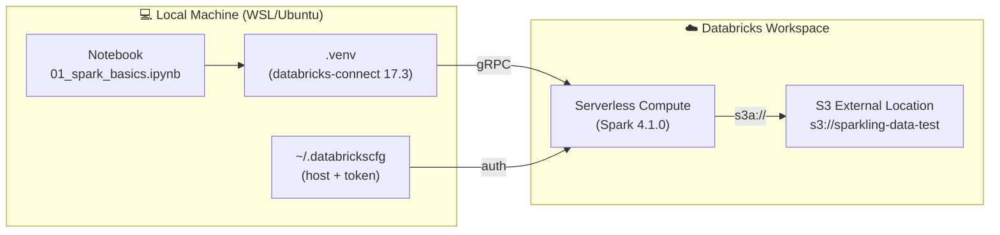
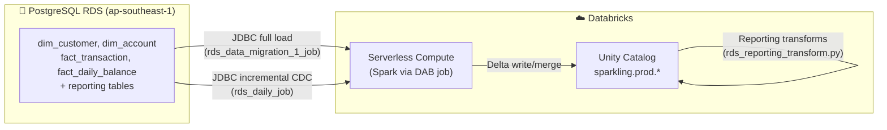

# 🔗 Databricks Connect: Run Notebooks Locally with Remote Engine

Run your local VS Code / Jupyter notebooks against **Databricks serverless compute** — full Spark power without spinning up a local JVM.

---

## How It Works



Your code runs **locally**. The Spark engine runs **on Databricks**. Data lives in **S3**.

---

## One-Time Setup

### Step 1 — Install system prerequisites

```bash
# Ubuntu 24.04 requires python3.12-venv explicitly
sudo apt install -y python3.12-venv
```

### Step 2 — Create a virtual environment

```bash
# Inside the project root
cd ~/sparking_repo/Spark-ling
python3 -m venv .venv

# Verify it was created correctly
ls .venv/bin/pip   # should exist
```

### Step 3 — Activate the venv and install packages

```bash
# IMPORTANT: always activate the venv first
source .venv/bin/activate

# Your prompt should now show (.venv) prefix
# Install Databricks Connect matching your DBR version + Jupyter kernel
pip install "databricks-connect==17.3.*" ipykernel

# Verify
python -c "import databricks.connect; print('✅ databricks-connect installed')"
```

> **Version rule**: use `databricks-connect==X.Y.*` where `X.Y` matches your Databricks Runtime.
> Check in Databricks: **Compute → Serverless** → look for runtime version (e.g. DBR 17.3 → use `17.3.*`).

### Step 4 — Configure credentials

```bash
# Create the credentials file directly (no Databricks CLI needed)
cat > ~/.databrickscfg << 'EOF'
[DEFAULT]
host  = https://dbc-a460ab68-eabd.cloud.databricks.com
token = <your-personal-access-token>
EOF
```

To generate a token: Databricks UI → top-right avatar → **Settings** → **Developer** → **Access tokens** → **Generate new token**.

### Step 5 — Register the Jupyter kernel in VS Code

```bash
# With venv activated:
python -m ipykernel install --user \
    --name sparkling-databricks \
    --display-name "Spark-ling (Databricks)"

# Confirm it registered
ls ~/.local/share/jupyter/kernels/sparkling-databricks/
```

### Step 6 — Test the connection

```bash
python -c "
from databricks.connect import DatabricksSession
spark = DatabricksSession.builder.serverless().getOrCreate()
print(f'✅ Connected! Spark version: {spark.version}')
spark.stop()
"
# Expected output: ✅ Connected! Spark version: 4.1.0
```

---

## Using in VS Code Notebooks

### Select the kernel

1. Open any `.ipynb` notebook in VS Code
2. Click **Select Kernel** (top-right)
3. Click **Python Environments...**
4. Choose: `.venv — Python 3.12 — .../Spark-ling/.venv/bin/python`

> If `.venv` is not listed:
> Press `Ctrl+Shift+P` → **"Python: Select Interpreter"** → paste the full path:
> `/home/huynguyenle/sparking_repo/Spark-ling/.venv/bin/python`
> Then re-open the kernel picker.

### Standard notebook cell pattern

```python
# Cell 1 — Connect to Databricks serverless
from databricks.connect import DatabricksSession

spark = DatabricksSession.builder.serverless().getOrCreate()
print(f"✅ Spark {spark.version} | Databricks serverless")
```

```python
# Cell 2 — Read data from S3 (Parquet, generated by scripts/generate_to_s3.py)
S3_RAW = "s3a://sparkling-data-test/data/raw"

branches_df     = spark.read.parquet(f"{S3_RAW}/branches")
customers_df    = spark.read.parquet(f"{S3_RAW}/customers")
accounts_df     = spark.read.parquet(f"{S3_RAW}/accounts")
transactions_df = spark.read.parquet(f"{S3_RAW}/transactions")

print(f"Branches:     {branches_df.count():>8,}")
print(f"Customers:    {customers_df.count():>8,}")
print(f"Accounts:     {accounts_df.count():>8,}")
print(f"Transactions: {transactions_df.count():>8,}")
```

```python
# Cell 3 — All standard DataFrame operations work as usual
from pyspark.sql import functions as F

customers_df \
    .groupBy("segment") \
    .count() \
    .orderBy(F.desc("count")) \
    .show()
```

---

## Daily Workflow

```bash
# Each new terminal session — activate venv first
cd ~/sparking_repo/Spark-ling
source .venv/bin/activate

# VS Code picks up the venv automatically once you've selected the kernel
# Just open the notebook and run cells
```

---

## Re-activate After Reboot

The venv is persistent — you only need to re-activate it each session:

```bash
source ~/sparking_repo/Spark-ling/.venv/bin/activate
```

Or add to your `~/.bashrc` for auto-activation:

```bash
echo 'source ~/sparking_repo/Spark-ling/.venv/bin/activate' >> ~/.bashrc
```

---

## Differences from Local Spark

| Feature | Local Spark (`local[*]`) | Databricks Connect (serverless) |
|---------|--------------------------|----------------------------------|
| Engine location | Your machine | Databricks cloud |
| Data location | `data/raw/*.csv` | `s3a://sparkling-data-test/data/raw/` |
| SparkSession | `get_spark_session(...)` | `DatabricksSession.builder.serverless()` |
| Spark UI | `http://localhost:4040` | Databricks workspace → Job runs |
| Java required | ✅ Yes (JDK 8/11) | ❌ No |
| Handles 5M rows | Slow (limited RAM) | Fast (cloud compute) |
| Delta Lake | Manual setup | Built-in |

---

## Troubleshooting

| Issue | Solution |
|-------|----------|
| `externally-managed-environment` pip error | Always use `.venv/bin/pip` or activate venv first with `source .venv/bin/activate` |
| `No module named 'databricks'` | Venv not activated — run `source .venv/bin/activate` |
| Kernel not showing in VS Code | `Ctrl+Shift+P` → **Python: Select Interpreter** → choose `.venv` path |
| `PERMISSION_DENIED` connecting | Check `~/.databrickscfg` has correct host and valid token |
| Token expired | Generate a new token in Databricks → Settings → Developer → Access tokens |
| `s3a://` path not found | Ensure External Location exists in Databricks Unity Catalog; run `scripts/generate_to_s3.py` first |
| Connection timeout | Serverless compute may be starting up — wait 30–60s and retry |

---

## RDS → Unity Catalog Pipeline (Databricks Asset Bundle)

The primary migration path is a **Databricks Asset Bundle** in `pipelines/rds_data_migration_1/`.
It packages Python jobs as a wheel and deploys two scheduled Databricks Jobs.

### Architecture



### Job structure

| Job | Schedule | Purpose |
|-----|----------|---------|
| `rds_data_migration_1_job` | Run once | Full load of all 7 RDS tables → Unity Catalog Delta |
| `rds_daily_job` | Daily 02:00 UTC | Incremental CDC + reporting transformations |

The daily job has two tasks in sequence:

```
rds_incremental_task  →  rds_reporting_task
(CDC watermark load)      (PySpark SP migration)
```

### Deploy in 3 commands

```bash
cd pipelines/rds_data_migration_1

# 1) Store RDS credentials securely (once)
databricks secrets create-scope sparkling
databricks secrets put-secret sparkling rds_host     --string-value "<endpoint>"
databricks secrets put-secret sparkling rds_username --string-value "sparkadmin"
databricks secrets put-secret sparkling rds_password --string-value "<password>"

# 2) Deploy the bundle
databricks bundle deploy --target prod

# 3) Run the one-time full load
databricks bundle run rds_data_migration_1_job --target prod

# The daily job runs automatically; trigger manually if needed:
databricks bundle run rds_daily_job --target prod
```

### File map

```
pipelines/rds_data_migration_1/
├── databricks.yml                              Bundle manifest (catalog, targets)
├── pyproject.toml                              Python package + entry points
├── resources/
│   ├── rds_data_migration_1_job.yml            Full load job definition
│   └── rds_daily_job.yml                       Daily incremental + reporting job
└── src/rds_data_migration_1_etl/transformations/
    ├── rds_ingest.py                           Full load (all tables → UC)
    ├── rds_incremental.py                      Incremental CDC (watermark-based)
    └── rds_reporting_transform.py              PySpark migration of 5 PostgreSQL SPs
```

### Interactive exploration

Open `notebooks/12_rds_to_databricks_pipeline.ipynb` to walk through the same
pipeline interactively with Databricks Connect before promoting to a scheduled job.
