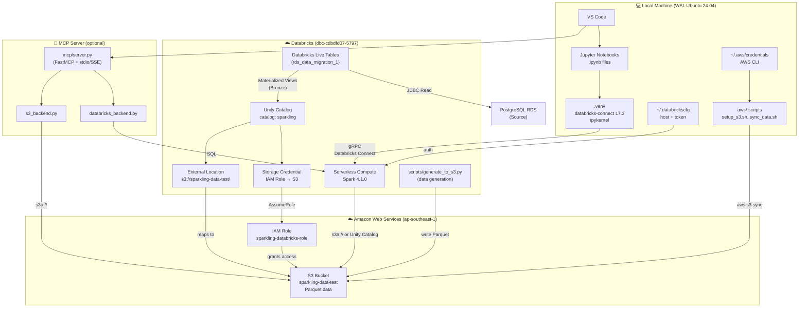

# 🔗 Integration Guide: Local IDE + Databricks + AWS S3

End-to-end architecture for the Spark-ling project: edit locally, run on Databricks serverless, store in S3.

---

## Architecture Overview



---

## Environment Summary

| Component | Details |
|-----------|---------|
| **OS** | WSL Ubuntu 24.04 |
| **Python** | 3.12 (via `.venv`) |
| **Local engine** | Databricks Connect 17.3.6 (remote → DBR 4.1.0) |
| **Databricks host** | `https://dbc-a460ab68-eabd.cloud.databricks.com` |
| **Storage** | `s3://sparkling-data-test` (ap-southeast-1) |
| **AWS Account** | `085587597183` |
| **IAM Role** | `sparkling-databricks-role` |
| **MCP transport** | `stdio` (local) / `sse` (EC2) |

---

## Quick Reference: Daily Commands

```bash
# Navigate to project
cd ~/sparking_repo/Spark-ling

# Activate virtual environment (every new terminal)
source .venv/bin/activate

# Check Databricks connection
python -c "
from databricks.connect import DatabricksSession
spark = DatabricksSession.builder.serverless().getOrCreate()
print(f'✅ Spark {spark.version}')
spark.stop()
"

# S3 data operations
./aws/sync_data.sh status     # what's in S3
./aws/sync_data.sh upload     # local → S3
./aws/sync_data.sh download   # S3 → local

# Re-generate data (on Databricks)
# Open Databricks notebook → %run /Repos/.../scripts/generate_to_s3
```

---

## How the Components Connect

### 1. Local IDE → Databricks (Databricks Connect)

Databricks Connect routes PySpark API calls over gRPC to Databricks serverless. Your local Python process becomes the "driver" in terms of code control, while Spark execution happens in the cloud.

**Config files involved:**
- `~/.databrickscfg` — contains `host` and `token`
- `.venv/` — contains `databricks-connect==17.3.*`

**Session creation:**
```python
from databricks.connect import DatabricksSession
spark = DatabricksSession.builder.serverless().getOrCreate()
```

### 2. Databricks → S3 (External Location)

Databricks Serverless accesses S3 via Unity Catalog's External Location mechanism:
- **Storage Credential** → IAM Role `sparkling-databricks-role` with trust policy for Databricks AWS account `414351767093`
- **External Location** → maps `s3://sparkling-data-test/` to the storage credential

```python
# In any notebook via Databricks Connect
df = spark.read.parquet("s3a://sparkling-data-test/data/raw/customers")
```

### 3. Local → S3 (AWS CLI)

For direct file operations (upload/download), the AWS CLI uses `~/.aws/credentials`:

```bash
aws s3 ls s3://sparkling-data-test/data/raw/
./aws/sync_data.sh upload
```

### 4. MCP Server → Data (stdio)

The MCP server runs as a subprocess in your IDE. The `command` in `.vscode/mcp.json` must point to the `.venv/bin/python` so all dependencies are available:

```json
{
  "servers": {
    "sparkling-data": {
      "command": "/home/huynguyenle/sparking_repo/Spark-ling/.venv/bin/python",
      "args": ["-m", "mcp.server"],
      "cwd": "/home/huynguyenle/sparking_repo/Spark-ling"
    }
  }
}
```

---

## Data Flow

```
Generate (Databricks serverless)
    ↓  scripts/generate_to_s3.py
    ↓  writes Parquet
S3: s3://sparkling-data-test/data/raw/
    ├── branches/ (100 rows)
    ├── customers/ (10K rows)
    ├── accounts/ (~15K rows)
    └── transactions/ (5M rows, 16 partitions)
    ↓  read via s3a://
Databricks Connect (local notebooks)
    ↓  transformations → writing back
S3: s3://sparkling-data-test/data/processed/
S3: s3://sparkling-data-test/data/analytics/
```

---

## Security: Secrets Management

| Secret | Location | Gitignored? |
|--------|----------|-------------|
| AWS credentials | `~/.aws/credentials` (via `aws configure`) | N/A (outside repo) |
| Databricks token | `~/.databrickscfg` | N/A (outside repo) |
| Project env vars | `aws/.env` | ✅ yes |
| MCP env vars | `mcp/.env` | ✅ yes |
| Ad-hoc notes | `.secrets` | ✅ yes |

---

## Troubleshooting Common Integration Issues

### "externally-managed-environment" when using pip
```bash
# Always use the venv pip, never system pip
source .venv/bin/activate
pip install <package>
```

### Databricks Connect not finding credentials
```bash
# Verify ~/.databrickscfg exists and has correct values
cat ~/.databrickscfg
# Should show:
# [DEFAULT]
# host  = https://dbc-a460ab68-eabd.cloud.databricks.com
# token = dapi...
```

### S3 "AccessDenied" from Databricks
```bash
# Verify External Location in Databricks
# Catalog → External Locations → sparkling-data-test → Test connection
# If fails: verify IAM trust policy has the correct External ID
```

### VS Code kernel not showing `.venv`
```
Ctrl+Shift+P → Python: Select Interpreter
→ Enter interpreter path manually:
  /home/huynguyenle/sparking_repo/Spark-ling/.venv/bin/python
```

### MCP server can't connect to Databricks
```bash
# Test manually
source .venv/bin/activate
python -c "
import databricks.sdk
w = databricks.sdk.WorkspaceClient()
print('Connected to:', w.config.host)
"
```
