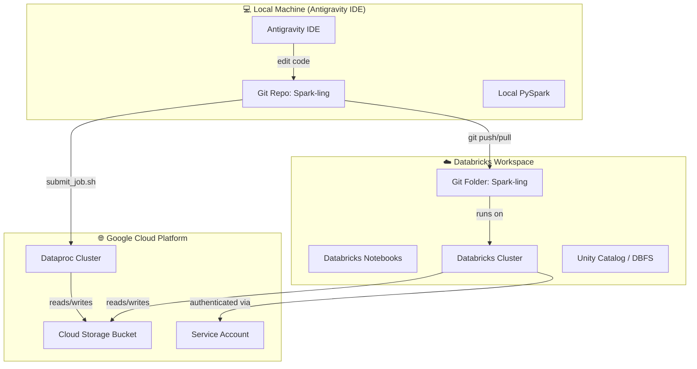
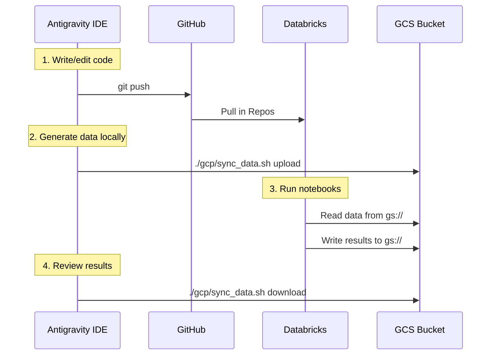

# 🔗 Integration Guide: GCP + Databricks + Antigravity

How the three components of your Spark-ling environment work together.

---

## Architecture Overview



---

## The Three Layers

| Component | Role | When to Use |
|-----------|------|-------------|
| **Antigravity (Local IDE)** | Code editing, git operations, debugging | Writing & refactoring code |
| **Databricks** | Interactive data exploration, notebook execution | Running notebooks, testing Spark logic on managed clusters |
| **GCP (Dataproc + GCS)** | Scalable infrastructure, data storage | Production-scale jobs, persistent data storage |

---

## How They Connect

### 1. Git is the Bridge 🌉

Your Git repo (`Spark-ling`) is the **single source of truth** that connects all three:

```
Antigravity (local) ←→ GitHub/GitLab ←→ Databricks (Git Folder)
```

**Workflow:**
1. **Edit locally** in Antigravity IDE
2. **Push to remote** (`git push`)
3. **Pull in Databricks** (Repos → your Spark-ling folder → Pull)
4. Run & test on Databricks clusters

> [!IMPORTANT]
> Always push from Antigravity first, then pull in Databricks. Avoid editing the same file in both places simultaneously.

---

### 2. GCS as Shared Data Layer 💾

Google Cloud Storage (GCS) is the **shared data storage** accessible from both Databricks and GCP Dataproc:

```
Local data/raw/ ──sync_data.sh──→ gs://your-bucket/data/raw/
                                         ↑
                              Databricks reads here
                              Dataproc reads here
```

---

## Step-by-Step Setup

### Step 1: Connect Databricks to GCS

Databricks needs a **GCP service account** to access your GCS bucket.

**Option A: If Databricks is running on GCP** (recommended)
- Your Databricks workspace is already on GCP — the cluster can access GCS natively
- Just mount or reference `gs://` paths directly in your notebooks

**Option B: If Databricks is on Azure/AWS**
- Create a GCS service account key:
  ```bash
  gcloud iam service-accounts keys create ~/sparkling-sa-key.json \
    --iam-account=sparkling-sa@YOUR_PROJECT.iam.gserviceaccount.com
  ```
- Upload the key to Databricks Secrets:
  ```bash
  # Install Databricks CLI
  pip install databricks-cli
  databricks configure --token

  # Create a secret scope and store the key
  databricks secrets create-scope --scope gcp-sparkling
  databricks secrets put --scope gcp-sparkling --key sa-key \
    --string-value "$(cat ~/sparkling-sa-key.json)"
  ```
- Configure Spark in your Databricks notebook:
  ```python
  # In a Databricks notebook cell
  import json

  sa_key = dbutils.secrets.get(scope="gcp-sparkling", key="sa-key")

  spark.conf.set("fs.gs.auth.service.account.enable", "true")
  spark.conf.set("fs.gs.project.id", "YOUR_PROJECT_ID")
  spark.conf.set("fs.gs.auth.service.account.json.keyfile", sa_key)
  ```

### Step 2: Update `spark_config.py` for Databricks Mode

Your `spark_config.py` already supports `local` and `gcp` modes. Add a `databricks` mode:

```python
# In configs/spark_config.py, add to get_spark_session():

def get_spark_session(app_name="Spark-ling", mode="local", enable_delta=False):
    if mode == "databricks":
        return _build_databricks_session(app_name)
    elif mode == "gcp":
        return _build_gcp_session(app_name, enable_delta)
    else:
        return _build_local_session(app_name, enable_delta)


def _build_databricks_session(app_name):
    """On Databricks, a SparkSession already exists - just return it."""
    return SparkSession.builder.appName(app_name).getOrCreate()
```

And update `get_data_path()`:

```python
def get_data_path(layer="raw", mode="local"):
    if mode == "databricks":
        # Option 1: Read from GCS (if configured)
        bucket = get_gcs_bucket()
        return f"gs://{bucket}/data/{layer}"
        # Option 2: Read from DBFS
        # return f"/dbfs/FileStore/sparkling/data/{layer}"
    elif mode == "gcp":
        bucket = get_gcs_bucket()
        return f"gs://{bucket}/data/{layer}"
    else:
        return str(PROJECT_ROOT / "data" / layer)
```

### Step 3: Fix `data_generator.py` for Databricks

From your screenshot, you hit this error in Databricks:

```
PROJECT_ROOT = Path(__file__).parent.parent
```

> `__file__` is not defined in Databricks notebooks/interactive environments.

**Fix** (already suggested by the Databricks assistant):

```python
# Replace this:
PROJECT_ROOT = Path(__file__).parent.parent

# With this:
PROJECT_ROOT = Path(__file__).parent.parent if '__file__' in dir() else Path.cwd()
```

### Step 4: Upload Data to GCS

From your local machine (Antigravity terminal):

```bash
# First, generate data locally
python src/data_generator.py

# Then sync to GCS
./gcp/sync_data.sh upload
```

Now both Databricks and Dataproc can read from `gs://your-bucket/data/raw/`.

### Step 5: Auto-Detect Environment

Add this helper to avoid manually specifying `mode` every time:

```python
# In configs/spark_config.py

def detect_mode():
    """Auto-detect which environment we're running in."""
    import os
    if "DATABRICKS_RUNTIME_VERSION" in os.environ:
        return "databricks"
    elif "DATAPROC_CLUSTER" in os.environ:
        return "gcp"
    else:
        return "local"
```

Usage in any notebook or script:

```python
from configs.spark_config import get_spark_session, get_data_path, detect_mode

mode = detect_mode()
spark = get_spark_session("MyApp", mode=mode)
data_path = get_data_path("raw", mode=mode)
```

---

## Day-to-Day Workflow



| Task | Where |
|------|-------|
| Edit Python/SQL code | **Antigravity** |
| Run notebooks interactively | **Databricks** |
| Generate synthetic data | **Antigravity** (local) |
| Store/share data | **GCS** |
| Run production batch jobs | **Dataproc** or **Databricks Jobs** |
| Version control | **Antigravity** → Git |

---

## Quick Reference Commands

```bash
# --- From Antigravity terminal ---

# Push code changes so Databricks can pull them
git add -A && git commit -m "update" && git push

# Upload local data to GCS (shared with Databricks)
./gcp/sync_data.sh upload

# Download results from GCS
./gcp/sync_data.sh download

# Submit a batch job to GCP Dataproc
./gcp/submit_job.sh pipelines/daily_transactions.py --date 2025-06-15
```

```python
# --- In Databricks notebook ---

# Pull latest code: Repos sidebar → Spark-ling → Pull

# Read data from GCS (if Databricks is on GCP)
df = spark.read.csv("gs://your-bucket/data/raw/transactions.csv", header=True)

# Or use the config helper
from configs.spark_config import get_data_path, detect_mode
mode = detect_mode()  # returns "databricks"
df = spark.read.csv(f"{get_data_path('raw', mode)}/transactions.csv", header=True)
```

---

## Troubleshooting

| Issue | Solution |
|-------|----------|
| `__file__` not defined in Databricks | Use `Path(__file__).parent if '__file__' in dir() else Path.cwd()` |
| Can't access GCS from Databricks | Mount GCS or configure service account credentials |
| Code out of sync between IDE and Databricks | Always `git push` from Antigravity, then Pull in Databricks |
| Data not found on Databricks | Run `./gcp/sync_data.sh upload` first from local |
