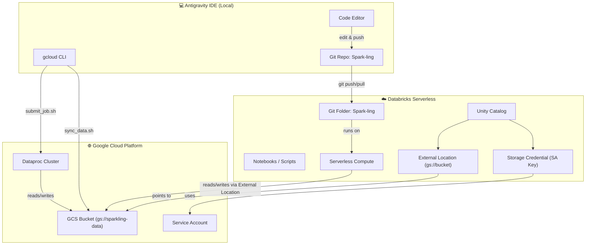
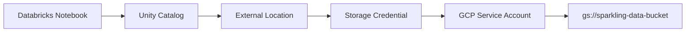
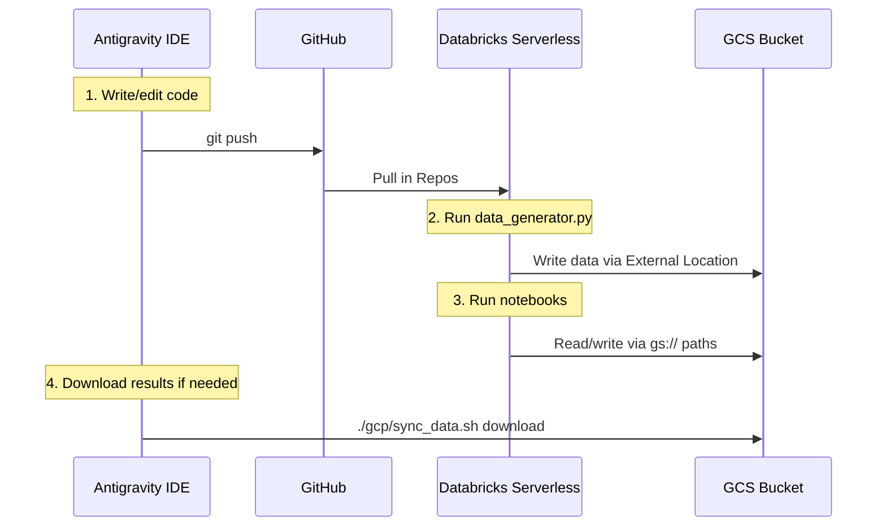

# 🔗 Integration Guide: GCP + Databricks Serverless + Antigravity

How to link GCP infrastructure, Databricks serverless, and Antigravity IDE for the Spark-ling project.

---

## Architecture Overview



---

## How to Identify Your Databricks Cloud Provider

Your Databricks workspace URL tells you which cloud it runs on:

| URL Pattern | Cloud |
|-------------|-------|
| `https://<id>.cloud.databricks.com` | **AWS** |
| `https://adb-<id>.azuredatabricks.net` | **Azure** |
| `https://<id>.<num>.gcp.databricks.com` | **GCP** |

> [!TIP]
> If your workspace URL contains `.gcp.databricks.com`, you're already on GCP — connecting to GCS is simplest. If you're on AWS/Azure, you'll use a cross-cloud service account key.

---

## Connecting Databricks Serverless to GCS

### The Goal

Save data generated in Databricks serverless directly to your GCS bucket (`gs://sparkling-data-*`), so all three environments share one data layer.

### Method: Unity Catalog External Location (Recommended)

This is the modern, secure way to connect Databricks to GCS — no legacy mounts required.



---

### Step 1: Create a GCP Service Account Key

Run this from your **Antigravity terminal**:

```bash
# If you already ran setup_gcp.sh, the service account exists.
# Just create a key for Databricks:

SA_EMAIL="sparkling-sa@YOUR_PROJECT_ID.iam.gserviceaccount.com"

gcloud iam service-accounts keys create ~/sparkling-dbx-key.json \
  --iam-account="$SA_EMAIL"

# Verify the key was created
cat ~/sparkling-dbx-key.json | head -5
```

> [!CAUTION]
> This key grants write access to your GCS bucket. Never commit it to Git. Delete it after uploading to Databricks secrets.

---

### Step 2: Create a Databricks Storage Credential

**In the Databricks UI:**

1. Go to **Catalog** → **External Data** → **Credentials** → **Create Credential**
2. Choose **Storage Credential**
3. Set:
   - **Name**: `gcs-sparkling-sa`
   - **Credential Type**: `GCP Service Account`
   - For **GCP Databricks**: paste the service account email (`sparkling-sa@YOUR_PROJECT.iam.gserviceaccount.com`)
   - For **AWS/Azure Databricks**: upload the JSON key file content from `~/sparkling-dbx-key.json`
4. Click **Create**

**Or via SQL in a Databricks notebook:**

```sql
-- For GCP-hosted Databricks (easiest):
CREATE STORAGE CREDENTIAL gcs_sparkling_sa
COMMENT 'Service account for Spark-ling GCS bucket';
-- Then grant storage admin role to the credential's SA email in GCP Console

-- For AWS/Azure-hosted Databricks (uses JSON key):
-- Use the UI method above, as SQL doesn't support pasting JSON keys directly
```

---

### Step 3: Create an External Location

This tells Databricks "this GCS path is allowed for read/write":

**In Databricks UI:**

1. Go to **Catalog** → **External Data** → **External Locations** → **Create Location**
2. Set:
   - **Name**: `sparkling_gcs`
   - **URL**: `gs://YOUR-BUCKET-NAME/` (e.g., `gs://sparkling-data-your-project-id/`)
   - **Storage Credential**: `gcs-sparkling-sa`
3. Click **Create**
4. Use **Test Connection** to verify ✅

**Or via SQL:**

```sql
CREATE EXTERNAL LOCATION sparkling_gcs
  URL 'gs://sparkling-data-your-project-id/'
  WITH (STORAGE CREDENTIAL gcs_sparkling_sa)
  COMMENT 'Spark-ling data on GCS';
```

---

### Step 4: Save Data from Databricks to GCS

Now you can read/write directly to GCS from any Databricks serverless notebook:

```python
# ── Write generated data to GCS ─────────────────────────────
GCS_PATH = "gs://sparkling-data-your-project-id/data"

# Save DataFrames to GCS
customers_df.write.mode("overwrite").csv(f"{GCS_PATH}/raw/customers.csv", header=True)
accounts_df.write.mode("overwrite").csv(f"{GCS_PATH}/raw/accounts.csv", header=True)
transactions_df.write.mode("overwrite").csv(f"{GCS_PATH}/raw/transactions.csv", header=True)
branches_df.write.mode("overwrite").csv(f"{GCS_PATH}/raw/branches.csv", header=True)

# Or write as Parquet (recommended for Spark — faster & smaller)
customers_df.write.mode("overwrite").parquet(f"{GCS_PATH}/raw/customers_parquet")

# ── Read back from GCS ──────────────────────────────────────
df = spark.read.csv(f"{GCS_PATH}/raw/customers.csv", header=True, inferSchema=True)
df.show(5)
```

> [!NOTE]
> Since `data_generator.py` currently writes to local CSV files, you need to either:
>
> - **Option A**: Run the generator locally → upload via `sync_data.sh` → read from GCS in Databricks
> - **Option B**: Convert the generated data to Spark DataFrames in Databricks and write to GCS directly (see updated `data_generator.py` below)

---

### Step 5: Create an External Table (Optional — Best Practice)

Register your GCS data in Unity Catalog so it's queryable by name:

```sql
-- Create a catalog and schema for your project
CREATE CATALOG IF NOT EXISTS sparkling;
CREATE SCHEMA IF NOT EXISTS sparkling.banking;

-- Register external tables pointing to GCS
CREATE TABLE IF NOT EXISTS sparkling.banking.customers
USING CSV
OPTIONS (header = 'true', inferSchema = 'true')
LOCATION 'gs://sparkling-data-your-project-id/data/raw/customers.csv';

CREATE TABLE IF NOT EXISTS sparkling.banking.transactions
USING CSV
OPTIONS (header = 'true', inferSchema = 'true')
LOCATION 'gs://sparkling-data-your-project-id/data/raw/transactions.csv';

-- Now query by name from ANY notebook
SELECT segment, COUNT(*) as cnt
FROM sparkling.banking.customers
GROUP BY segment;
```

---

## Code Changes Made

### `data_generator.py` — Fixed `__file__` for Databricks

The `__file__` variable is not defined in Databricks notebooks/interactive environments. Updated to auto-detect:

```diff
-PROJECT_ROOT = Path(__file__).parent.parent
+PROJECT_ROOT = Path(__file__).parent.parent if '__file__' in dir() else Path.cwd()
```

### `spark_config.py` — Added Databricks Mode + Auto-Detection

Added `detect_mode()` and a `databricks` mode so code runs everywhere without changes:

```python
# Auto-detect environment — no need to pass mode manually
mode = detect_mode()  # → "databricks", "gcp", or "local"
spark = get_spark_session("MyApp", mode=mode)
data_path = get_data_path("raw", mode=mode)
```

---

## Day-to-Day Workflow



| Task | Where |
|------|-------|
| Edit Python/SQL code | **Antigravity** |
| Run notebooks interactively | **Databricks Serverless** |
| Generate synthetic data | **Databricks** or **Antigravity** (local) |
| Persistent data storage | **GCS** (shared across all) |
| Run production batch jobs | **Databricks Jobs** or **Dataproc** |
| Version control | **Antigravity** → Git |

---

## Quick Reference

```bash
# ── From Antigravity terminal ──
git add -A && git commit -m "update" && git push   # Push code
./gcp/sync_data.sh upload                            # Upload local data to GCS
./gcp/sync_data.sh download                          # Download results from GCS
```

```python
# ── In Databricks notebook ──
# Read from GCS (after External Location is set up)
df = spark.read.csv("gs://your-bucket/data/raw/transactions.csv", header=True)

# Use the config helper for portable code
from configs.spark_config import get_spark_session, get_data_path, detect_mode
mode = detect_mode()  # returns "databricks"
spark = get_spark_session("MyApp", mode=mode)
raw = get_data_path("raw", mode=mode)  # returns "gs://bucket/data/raw"
```

---

## Troubleshooting

| Issue | Solution |
|-------|----------|
| `__file__` not defined in Databricks | Already fixed — uses `Path.cwd()` fallback |
| `PERMISSION_DENIED` on `gs://` path | Check External Location + Storage Credential in Unity Catalog |
| Can't create Storage Credential | Need `CREATE STORAGE CREDENTIAL` privilege — ask workspace admin |
| Data not showing in Databricks | Run `sync_data.sh upload` from local, or write directly from Databricks |
| Code out of sync | Always `git push` from Antigravity → Pull in Databricks Repos |
| GCS connector not found (AWS/Azure) | Install `gcs-connector` library on cluster or use Databricks secrets approach |
