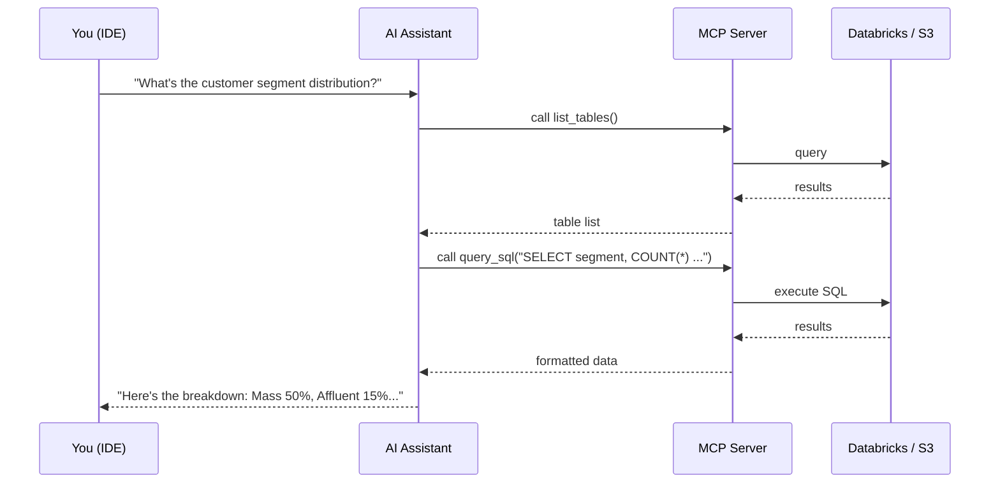

# 🔌 MCP Guide: AI-Assisted Data Exploration

Use the **Model Context Protocol (MCP)** to let AI assistants (Claude, Gemini, etc.) query your Spark-ling banking data directly from your IDE.

---

## What is MCP?

MCP allows AI coding assistants to access external data through a standardized protocol. The Spark-ling MCP server exposes your banking data as callable tools.



---

## Quick Setup (Local — stdio transport)

### Step 1 — Install MCP dependencies

```bash
# Activate the project venv first
source ~/sparking_repo/Spark-ling/.venv/bin/activate

# Install MCP server dependencies
pip install -r mcp/requirements.txt
```

### Step 2 — Configure the MCP backend

```bash
cp mcp/.env.example mcp/.env
```

Edit `mcp/.env`:

```env
# Choose backend: databricks | s3 | auto
MCP_BACKEND=databricks

# Databricks settings
DATABRICKS_HOST=https://dbc-cdbdfd07-5797.cloud.databricks.com
DATABRICKS_TOKEN=<your-personal-access-token>
DATABRICKS_WAREHOUSE_ID=f31ee3e8261856ac

# S3 settings (used if MCP_BACKEND=s3 or auto fallback)
S3_BUCKET=sparkling-data-test
AWS_REGION=ap-southeast-1
```

| `MCP_BACKEND` | When to use | Requires |
|---------------|-------------|----------|
| `databricks` | Rich SQL queries via SQL warehouse | Running warehouse + token |
| `s3` | Cost-effective, reads Parquet directly | AWS credentials + S3 data |
| `auto` | Tries Databricks first, falls back to S3 | Either credentials set |

### Step 3 — Test the server locally

```bash
# With .venv activated, from project root:
python -m mcp.server
# Should print: Starting Spark-ling MCP server (transport=stdio)...
# Press Ctrl+C to stop
```

### Step 4 — Connect to VS Code

Create `.vscode/mcp.json` in the project root:

```json
{
  "servers": {
    "sparkling-data": {
      "command": "/home/huynguyenle/sparking_repo/Spark-ling/.venv/bin/python",
      "args": ["-m", "mcp.server"],
      "cwd": "/home/huynguyenle/sparking_repo/Spark-ling",
      "env": {
        "MCP_BACKEND": "databricks"
      }
    }
  }
}
```

> **Important**: Use the full `.venv/bin/python` path — not just `python` — so the MCP server uses the correct venv with all dependencies installed.

### Step 5 — Connect to Gemini / Antigravity

Add to `.gemini/settings.json` or workspace MCP config:

```json
{
  "mcpServers": {
    "sparkling-data": {
      "command": "/home/huynguyenle/sparking_repo/Spark-ling/.venv/bin/python",
      "args": ["-m", "mcp.server"],
      "cwd": "/home/huynguyenle/sparking_repo/Spark-ling"
    }
  }
}
```

### Step 6 — Connect to Cursor

In Cursor → Settings → MCP:

```json
{
  "mcpServers": {
    "sparkling-data": {
      "command": "/home/huynguyenle/sparking_repo/Spark-ling/.venv/bin/python",
      "args": ["-m", "mcp.server"],
      "cwd": "/home/huynguyenle/sparking_repo/Spark-ling"
    }
  }
}
```

---

## Available Tools

| Tool | Description | Example Prompt |
|------|-------------|----------------|
| `list_tables` | List all datasets | *"What tables are available?"* |
| `describe_table` | Get column names & types | *"Show me the schema of transactions"* |
| `sample_data` | Preview first N rows | *"Show me 5 sample customers"* |
| `query_sql` | Run read-only SQL | *"How many transactions per month?"* |
| `get_data_profile` | Stats: nulls, distinct counts | *"Profile the accounts table"* |

### Example Conversations

> **You**: *"What does the customer data look like?"*
> **AI** → `describe_table("customers")` → shows schema → `sample_data("customers", 5)` → shows rows

> **You**: *"Which branches have the most high-value transactions?"*
> **AI** → `query_sql("SELECT b.branch_name, COUNT(*) FROM branches b JOIN accounts a ...")`

> **You**: *"Are there data quality issues in transactions?"*
> **AI** → `get_data_profile("transactions")` → analyzes nulls and distributions

---

## MCP Server Architecture

```
mcp/
├── server.py              # FastMCP entry point; handles tool routing
├── config.py              # Reads mcp/.env, selects backend
├── databricks_backend.py  # Queries via Databricks SQL warehouse (JDBC)
├── s3_backend.py          # Reads Parquet from S3 via local PySpark
├── deploy_ec2.sh          # Deploy MCP server to EC2 for always-on access
├── .env.example           # Config template → copy to .env
└── requirements.txt       # mcp[cli], databricks-sql-connector, boto3, etc.
```

**Transport modes:**
- `stdio` — for local IDE integration (default)
- `sse` — for remote EC2 deployment (set `MCP_TRANSPORT=sse`)

---

## 🚀 Optional: Deploy on AWS EC2

Run the MCP server on a `t3.small` EC2 instance for always-on remote access.

### Step 1 — Prerequisites

In `aws/.env`, ensure these are set:
```env
AWS_REGION=ap-southeast-1
KEY_NAME=<your-ec2-key-pair-name>
```

### Step 2 — Launch the EC2 instance

```bash
./mcp/deploy_ec2.sh
```

This script:
1. Creates a security group allowing SSH (port 22) and MCP (port 8080)
2. Launches a `t3.small` Amazon Linux instance
3. Runs a user-data script that installs Python, clones the repo, installs deps, and starts a `systemd` service

### Step 3 — Upload code and config

When the script completes, it prints the instance IP and the commands to run:

```bash
# Upload project files
scp -i ~/.ssh/your-key.pem -r . ec2-user@<IP>:/opt/sparkling-mcp/

# Upload MCP secrets
scp -i ~/.ssh/your-key.pem mcp/.env ec2-user@<IP>:/opt/sparkling-mcp/mcp/.env

# Start the service
ssh -i ~/.ssh/your-key.pem ec2-user@<IP> \
    'sudo systemctl start sparkling-mcp && sudo systemctl status sparkling-mcp'
```

### Step 4 — Connect IDE to EC2 (SSE transport)

```json
{
  "mcpServers": {
    "sparkling-data": {
      "url": "http://<EC2-IP>:8080/sse"
    }
  }
}
```

### Step 5 — Manage the EC2 instance

```bash
./mcp/deploy_ec2.sh status     # get IP, check running status
./mcp/deploy_ec2.sh teardown   # terminate instance + delete security group
```

### Step 6 — SSH into the instance for debugging

```bash
ssh -i ~/.ssh/your-key.pem ec2-user@<IP>

# Check service logs
sudo journalctl -u sparkling-mcp -f

# Restart the service
sudo systemctl restart sparkling-mcp
```

---

## Troubleshooting

| Issue | Solution |
|-------|----------|
| `No module named 'mcp'` | Activate venv: `source .venv/bin/activate` then `pip install -r mcp/requirements.txt` |
| MCP server won't start | Check `mcp/.env` exists and has valid credentials |
| `"DATABRICKS_HOST not set"` | Fill in `mcp/.env` or set `MCP_BACKEND=s3` to skip Databricks |
| Databricks connection refused | Verify token and warehouse ID; ensure warehouse is not suspended |
| S3 access denied | Run `aws sts get-caller-identity`; check `aws configure` credentials |
| Slow queries on S3 backend | Normal — S3 backend runs PySpark locally; use Databricks backend for speed |
| IDE can't find MCP server | Use the full `.venv/bin/python` path in your IDE MCP config, not just `python` |
| EC2 service not starting | SSH in and check: `sudo journalctl -u sparkling-mcp -n 50` |
