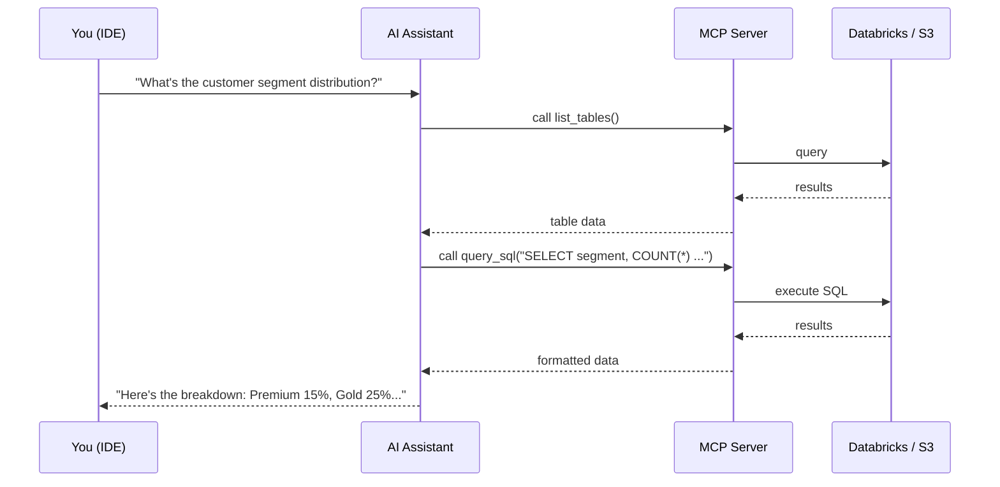

# 🔌 MCP Guide: AI-Assisted Data Exploration

Use the **Model Context Protocol (MCP)** to let AI assistants query and explore your Spark-ling banking data directly from your IDE.

---

## What is MCP?

MCP allows AI coding assistants (Claude, Gemini, etc.) to access external data through a standardized protocol. The Spark-ling MCP server exposes your banking data as tools the AI can call.



---

## Quick Setup

### 1. Install Dependencies

```bash
pip install -r mcp/requirements.txt
```

### 2. Configure Backend

```bash
cp mcp/.env.example mcp/.env
```

Edit `mcp/.env` and choose your backend:

| Backend      | When to use                              | Requires                      |
| ------------ | ---------------------------------------- | ----------------------------- |
| `databricks` | Rich queries, Unity Catalog tables       | Running SQL warehouse + token |
| `s3`         | Cost-effective, no cloud compute         | AWS credentials + S3 bucket   |
| `auto`       | Tries Databricks first, falls back to S3 | Either set of credentials     |

### 3. Connect to Your IDE

#### Antigravity / Gemini Code Assist

Add to your MCP settings (`.gemini/settings.json` or workspace config):

```json
{
  "mcpServers": {
    "sparkling-data": {
      "command": "python",
      "args": ["-m", "mcp.server"],
      "cwd": "/path/to/Spark-ling"
    }
  }
}
```

#### VS Code / Claude

Add to `.vscode/mcp.json`:

```json
{
  "servers": {
    "sparkling-data": {
      "command": "python",
      "args": ["-m", "mcp.server"],
      "cwd": "/path/to/Spark-ling"
    }
  }
}
```

#### Cursor

Add to Cursor MCP settings:

```json
{
  "mcpServers": {
    "sparkling-data": {
      "command": "python",
      "args": ["-m", "mcp.server"],
      "cwd": "/path/to/Spark-ling"
    }
  }
}
```

---

## Available Tools

| Tool               | Description                   | Example Prompt                       |
| ------------------ | ----------------------------- | ------------------------------------ |
| `list_tables`      | List all datasets             | "What tables are available?"         |
| `describe_table`   | Get column names & types      | "Show me the schema of transactions" |
| `sample_data`      | Preview first N rows          | "Show me 5 sample customers"         |
| `query_sql`        | Run read-only SQL             | "How many transactions per month?"   |
| `get_data_profile` | Stats: nulls, distinct counts | "Profile the accounts table"         |

### Example Conversations

> **You**: "What does the customer data look like?"
>
> **AI** uses `describe_table("customers")` → shows schema, then `sample_data("customers", 5)` → shows preview

> **You**: "Which branches have the most high-value transactions?"
>
> **AI** uses `query_sql("SELECT b.branch_name, COUNT(*) ... WHERE t.amount > 50000 ... GROUP BY ...")`

> **You**: "Are there data quality issues in the transactions table?"
>
> **AI** uses `get_data_profile("transactions")` → analyzes null counts and distributions

---

## Architecture

```
mcp/
├── server.py              # FastMCP server — entry point
├── config.py              # Loads settings from .env
├── databricks_backend.py  # Connects to Databricks SQL warehouse
├── s3_backend.py          # Reads directly from S3 via PySpark
├── .env.example           # Configuration template
└── requirements.txt       # Python dependencies
```

---

## 🚀 Deploy on AWS EC2

Run the MCP server on a small EC2 instance for always-on access.

### 1. Deploy

```bash
# Ensure aws/.env is configured with KEY_PAIR and region
./mcp/deploy_ec2.sh
```

This launches a `t3.small` instance, installs Python + dependencies, and configures a systemd service.

### 2. Upload Code & Config

```bash
# Upload project (shown in deploy output)
scp -i ~/.ssh/your-key.pem -r ./ ec2-user@<IP>:/opt/sparkling-mcp/

# Upload MCP secrets
scp -i ~/.ssh/your-key.pem mcp/.env ec2-user@<IP>:/opt/sparkling-mcp/mcp/.env

# Start the service
ssh -i ~/.ssh/your-key.pem ec2-user@<IP> 'sudo systemctl start sparkling-mcp'
```

### 3. Connect Your IDE (SSE Transport)

The EC2 server runs on port **8080** using SSE transport.

#### Antigravity / VS Code / Cursor

```json
{
  "mcpServers": {
    "sparkling-data": {
      "url": "http://<EC2-IP>:8080/sse"
    }
  }
}
```

### 4. Manage

```bash
./mcp/deploy_ec2.sh status      # Check instance IP/status
./mcp/deploy_ec2.sh teardown    # Terminate instance
```

---

## Troubleshooting

| Issue                         | Solution                                                   |
| ----------------------------- | ---------------------------------------------------------- |
| MCP server won't start        | Check `pip install -r mcp/requirements.txt`                |
| "DATABRICKS_HOST not set"     | Fill in `mcp/.env` or set `MCP_BACKEND=s3`                 |
| Databricks connection refused | Verify token and warehouse ID; ensure warehouse is running |
| S3 access denied              | Check AWS credentials (`aws configure`)                    |
| Slow queries on S3 backend    | Use Parquet data; the S3 backend runs PySpark locally      |
| AI can't find the MCP server  | Verify the `cwd` path in your IDE's MCP config             |
