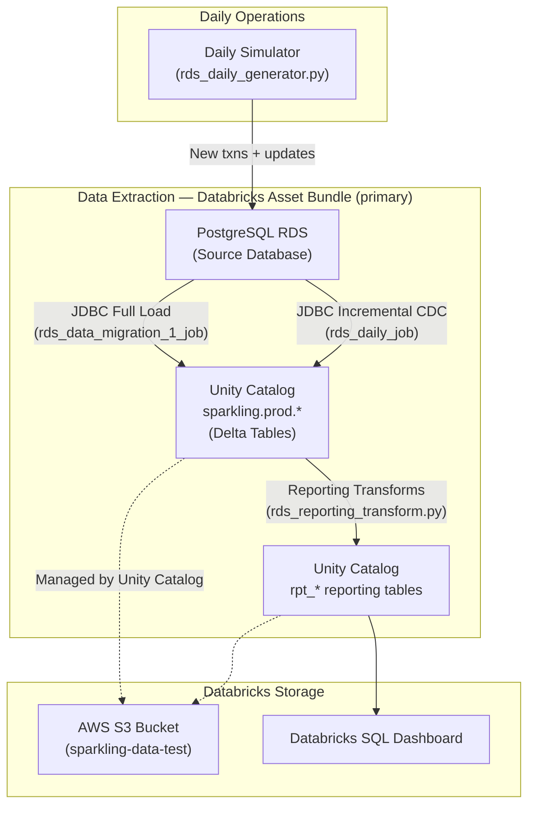

# RDS PostgreSQL → Databricks Migration: 2-Day Learning Guide

> **Goal**: Build an end-to-end migration pipeline from PostgreSQL RDS to Databricks,
> simulating a real banking data migration workflow.
>
> **Why PostgreSQL?** Many enterprises (including banks) migrate FROM Oracle TO PostgreSQL
> to save on licensing costs — so this is a very realistic scenario! The pipeline concepts
> (JDBC extraction, CDC, Medallion architecture) are identical regardless of source database.

## Recommended Approach: Databricks Asset Bundle

> [!IMPORTANT]
> The **primary production path** for this migration is the Databricks Asset Bundle in
> `pipelines/rds_data_migration_1/`. It packages all pipeline code as a Python wheel
> and deploys scheduled Databricks Jobs to Unity Catalog.
>
> The manual Python scripts described in Day 1/Day 2 below are retained for **learning purposes**
> only. For actual deployments, use the Asset Bundle.

### Quick start with the Asset Bundle

```bash
cd pipelines/rds_data_migration_1

# 1) Store RDS credentials in Databricks secret scope
databricks secrets create-scope sparkling
databricks secrets put-secret sparkling rds_host     --string-value "<endpoint>"
databricks secrets put-secret sparkling rds_username --string-value "sparkadmin"
databricks secrets put-secret sparkling rds_password --string-value "<password>"

# 2) Deploy jobs to Databricks workspace
databricks bundle deploy --target prod

# 3) Run the one-time full load (bootstraps Unity Catalog tables)
databricks bundle run rds_data_migration_1_job --target prod

# 4) Daily incremental CDC + reporting runs automatically at 02:00 UTC
#    Trigger manually if needed:
databricks bundle run rds_daily_job --target prod
```

### Job structure

| Job | When to run | Tasks |
|-----|-------------|-------|
| `rds_data_migration_1_job` | Once (initial bootstrap) | Full JDBC load of 7 RDS tables → Unity Catalog |
| `rds_daily_job` | Daily (02:00 UTC) | `rds_incremental_task` → `rds_reporting_task` |

The daily job task chain:
- **rds_incremental_task**: Reads new/changed rows via CDC watermarks; merges into Unity Catalog Delta tables
- **rds_reporting_task**: Runs 5 PySpark reporting transformations (migrated from PostgreSQL stored procedures)

### Reporting tables (migrated from PostgreSQL stored procedures)

| Reporting Table | PostgreSQL SP | Purpose |
|-----------------|--------------|---------|
| `rpt_monthly_txn_summary` | `sp_populate_rpt_monthly_txn_summary` | Monthly volume per customer/type |
| `rpt_account_balance_snapshot` | `sp_populate_rpt_account_balance_snapshot` | End-of-day balances with VND tiering |
| `rpt_customer_segment_kpi` | `sp_populate_rpt_customer_segment_kpi` | Segment KPIs for management |
| `rpt_channel_analysis` | `sp_populate_rpt_channel_analysis` | Digital vs traditional channel mix |
| `rpt_dormant_watchlist` | `sp_populate_rpt_dormant_watchlist` | Inactive accounts (SBV compliance) |

### Interactive exploration

Open `notebooks/12_rds_to_databricks_pipeline.ipynb` to walk through the pipeline
interactively using Databricks Connect before running it as a scheduled job.

---

## Prerequisites

Before starting, ensure you have:

| Requirement | Status | Command to Verify |
|---|---|---|
| AWS CLI configured | Required | `aws sts get-caller-identity` |
| Python 3.9+ | Required | `python3 --version` |
| pip packages | Required | `pip install psycopg2-binary pyspark delta-spark numpy` |
| AWS Region set | ap-southeast-1 | `echo $AWS_REGION` |
| S3 bucket exists | sparkling-data-test | `aws s3 ls s3://sparkling-data-test/` |
| Databricks workspace | Optional (Day 2) | Check your Databricks URL |

> [!IMPORTANT]
> **Cost Warning**: PostgreSQL RDS `db.t3.medium` costs **~$0.04/hr (~$0.96/day)**.
> Always run `aws/rds/rds_teardown.sh` when done to stop billing!

---

## Architecture



---

## Day 1: Initial Migration (4-6 hours)

### Step 1.1: Deploy PostgreSQL RDS (~15 min)

**What you'll learn**: AWS CloudFormation, RDS PostgreSQL provisioning, VPC security groups.

```bash
# Get your current IP for security group
MY_IP=$(curl -s ifconfig.me)
echo "Your IP: ${MY_IP}"

# Deploy the CloudFormation stack
aws cloudformation deploy \
  --template-file aws/rds/rds_setup.yaml \
  --stack-name sparkling-rds-postgres \
  --parameter-overrides \
    MasterPassword='SparkLing2026!' \
    AllowedCIDR="${MY_IP}/32" \
  --region ap-southeast-1

# Get the RDS endpoint (wait 5-10 min for creation)
aws cloudformation describe-stacks \
  --stack-name sparkling-rds-postgres \
  --query 'Stacks[0].Outputs[*].[OutputKey,OutputValue]' \
  --output table \
  --region ap-southeast-1
```

> [!NOTE]
> **Why PostgreSQL RDS?** PostgreSQL is open-source, free-tier eligible, and widely used
> in banking migrations. The JDBC extraction, CDC, and pipeline patterns are identical
> to Oracle — only the driver and SQL syntax differ slightly.

**Save the endpoint** — update `aws/.env`:

```bash
# Add these lines to aws/.env
RDS_HOST=sparkling-postgres-db.xxxxxxxxx.ap-southeast-1.rds.amazonaws.com
RDS_PORT=5432
RDS_DATABASE=sparkdb
RDS_USERNAME=sparkadmin
RDS_PASSWORD=SparkLing2026!
```

---

### Step 1.2: Create Schema & Seed Data (~20 min)

**What you'll learn**: PostgreSQL DDL, dimension/fact modeling, SCD Type 2 design, batch inserts.

```bash
# Install PostgreSQL driver
pip install psycopg2-binary

# Create schema and seed data
python aws/rds/rds_seed_data.py
```

**Key tables created**:

| Table | Type | Rows | Purpose |
|---|---|---|---|
| `dim_date` | Dimension | ~2,557 | Calendar (2020-2026) |
| `dim_branch` | Dimension | 100 | Bank branches |
| `dim_account_type` | Dimension | 6 | Account categories |
| `dim_customer` | Dimension (SCD2) | 10,000 | Customer master with history |
| `fact_transaction` | Fact | 500,000 | Banking transactions |
| `fact_daily_balance` | Fact (Snapshot) | 150,000 | End-of-day balances |
| `cdc_watermark` | System | 5 | CDC tracking |

> [!TIP]
> **Study the schema**: Open `aws/rds/rds_schema.sql` and read the comments.
> Pay attention to: `last_modified` columns (CDC), `GENERATED ALWAYS AS IDENTITY`
> columns (surrogate keys), `is_current` flag (SCD Type 2), and the `cdc_watermark` table.
> Comments compare PostgreSQL syntax with Oracle equivalents.

**Validate the seeding**:

```bash
python aws/rds/rds_seed_data.py --validate-only
```

---

### Step 1.3: Full Load Migration (~30 min)

**What you'll learn**: Spark JDBC, parallel extraction, S3 landing zone, Delta Lake Bronze tables.

```bash
# Install Spark dependencies
pip install pyspark delta-spark

# Run the full load pipeline
python pipelines/migration/full_load_pipeline.py
```

**What happens under the hood**:

1. **JDBC Extraction**: Spark connects to PostgreSQL via `spark.read.jdbc()` with parallel partitions
2. **S3 Landing**: Raw data lands as Parquet in `s3://sparkling-data-test/migration/landing/`
3. **Bronze Delta**: Data is converted to Delta format with ingestion metadata

> [!NOTE]
> **Why not JDBC directly to Databricks?**
> Direct JDBC is slow for large tables. The S3 intermediate pattern is
> standard in production: extract → land → load. AWS DMS automates this,
> but understanding the manual process is valuable.

**Validate the migration**:

```bash
python pipelines/migration/full_load_pipeline.py --validate-only
```

---

### Step 1.4: Bronze → Silver Transformation (~30 min)

**What you'll learn**: Data quality validation, deduplication, null handling, SCD Type 2, column standardization.

```bash
python pipelines/migration/bronze_to_silver.py
```

**Transformations applied**:

- Column names: PostgreSQL already uses `snake_case` (unlike Oracle's `UPPER_CASE`)
- Null handling: Fill defaults or quarantine
- Deduplication: Remove duplicate `txn_id` values
- Enrichment: `amount_category`, `age_group`, `suspicious_flag`
- Quality flags: `dq_has_null_name`, `dq_valid_amount`

> [!TIP]
> **Study the code**: Open `pipelines/migration/bronze_to_silver.py` and trace
> each transformation. The Silver layer is where you enforce the "single source of truth".

---

### Step 1.5: Silver → Gold Aggregation (~20 min)

**What you'll learn**: Star schema joins, business aggregations, Customer 360, risk alerting.

```bash
python pipelines/migration/silver_to_gold.py
```

**Gold tables built**:

| Gold Table | Business Purpose | Key Metrics |
|---|---|---|
| `daily_branch_summary` | Branch performance | Revenue, volume, suspicious count |
| `customer_360` | Complete customer profile | CLV, tenure, channel preference |
| `monthly_balance_trends` | Balance trend analysis | Avg balance, volatility, net flow |
| `risk_alerts` | Compliance/AML | Suspicious transactions by risk level |

---

### Step 1.6: Run the Full Pipeline via Orchestrator (~5 min)

**What you'll learn**: Pipeline DAG, dependency resolution, retry logic, orchestration patterns.

```bash
# Dry run to see execution plan
python pipelines/migration/pipeline_orchestrator.py --mode dry-run

# Full initial migration (all steps above in sequence)
python pipelines/migration/pipeline_orchestrator.py --mode initial
```

---

## Day 2: Daily Operations & Monitoring (4-6 hours)

### Step 2.1: Simulate Daily Activity (~15 min)

**What you'll learn**: Operational data patterns, SCD Type 2 updates, transaction generation.

```bash
# Simulate one day of banking activity
python aws/rds/rds_daily_generator.py --simulate-date 2026-03-07

# Simulate a full week
python aws/rds/rds_daily_generator.py \
  --start-date 2026-03-01 \
  --end-date 2026-03-07
```

**What this generates**:

- ~5,000 new transactions per weekday (~1,000 on weekends)
- ~200 customer attribute changes (SCD Type 2)
- End-of-day balance snapshots for 5,000 accounts

> [!NOTE]
> **Scaling Performance (Learning Curve)**:
> When scaling from 5k to 2M+ rows (3M rows weekday / 1.5M weekend):
>
> 1. **Memory**: A Python list of 3M dicts can exceed 1.5GB RAM. Increase Lambda `MemorySize` to 3008MB+.
> 2. **Timeout**: Bulk inserts of 3M rows take time. Increase Lambda `Timeout` to 900s (15 min).
> 3. **Database IOPS**: Massive writes on `db.t3.micro` may cause throttling. In production, use `gp3` storage with high provisioned IOPS.
> 4. **Batching**: Always use `execute_values` (psycopg2) or Spark-based loaders. Row-by-row inserts will fail scaling tests.

---

### Step 2.2: Run Incremental CDC Pipeline (~20 min)

**What you'll learn**: CDC watermark pattern, Delta MERGE, incremental processing.

```bash
# Check current watermarks
python pipelines/migration/incremental_load_pipeline.py --show-watermarks

# Run the incremental pipeline
python pipelines/migration/incremental_load_pipeline.py

# Check updated watermarks
python pipelines/migration/incremental_load_pipeline.py --show-watermarks
```

> [!IMPORTANT]
> **CDC is the hardest part of migration**: Understanding how changed data
> flows from source to destination is the #1 skill for data engineering.
> Study `incremental_load_pipeline.py` thoroughly.

---

### Step 2.3: Run Daily Orchestration (~10 min)

```bash
python pipelines/migration/pipeline_orchestrator.py --mode daily
```

This runs the full daily cycle: CDC → Bronze → Silver → Gold.

---

### Step 2.4: Set Up Monitoring Dashboard (~30 min)

**What you'll learn**: Databricks SQL dashboards, data freshness monitoring, operational metrics.

Open `pipelines/migration/monitor_dashboard.sql` and create each query in your Databricks workspace:

1. Go to **Databricks SQL → Queries → Create Query**
2. Paste each query from the SQL file
3. Create a **Dashboard** and add each query as a widget

---

### Step 2.5: Validation & Consistency Checks (~20 min)

```bash
# Cross-layer validation
python pipelines/migration/pipeline_orchestrator.py --mode validate
```

**Manual checks to perform**:

1. Compare RDS `fact_transaction` count with Bronze total
2. Verify Silver has fewer rows than Bronze (quarantined records)
3. Check Gold `customer_360` matches Silver `dim_customer` current records
4. Confirm CDC watermarks advanced after incremental run

---

### Step 2.6: Teardown (~5 min)

> [!CAUTION]
> **Stop billing immediately after learning!**

```bash
# Destroy PostgreSQL RDS (saves ~$0.96/day)
chmod +x aws/rds/rds_teardown.sh
./aws/rds/rds_teardown.sh

# (Optional) Clean S3 migration data
aws s3 rm s3://sparkling-data-test/migration/ --recursive
```

---

## Key Concepts Reference

### Medallion Architecture (Bronze/Silver/Gold)

| Layer | Format | Purpose | Update Pattern |
|---|---|---|---|
| **Bronze** | Delta (raw) | Exact copy of source | Append/MERGE |
| **Silver** | Delta (clean) | Validated, deduplicated | Overwrite/MERGE |
| **Gold** | Delta (aggregated) | Business metrics | Overwrite |

### CDC Strategies Comparison

| Strategy | Complexity | Latency | Captures Deletes? | Tool |
|---|---|---|---|---|
| Timestamp watermark | Low | Minutes-Hours | ❌ | This pipeline |
| PostgreSQL logical repl | Medium | Seconds | ✅ | pgoutput / wal2json |
| AWS DMS | Low | Seconds | ✅ | AWS managed |
| Debezium | Medium | Seconds | ✅ | Open source |

### File Map

```
aws/rds/
├── rds_setup.yaml          # CloudFormation for PostgreSQL RDS
├── rds_teardown.sh         # Cleanup script
├── rds_schema.sql          # PostgreSQL DDL (6 tables + CDC)
├── rds_seed_data.py        # Initial data seeder (psycopg2)
└── rds_daily_generator.py  # Daily activity simulator

pipelines/migration/
├── full_load_pipeline.py          # Initial full extraction
├── incremental_load_pipeline.py   # Daily CDC pipeline
├── bronze_to_silver.py            # Data quality & transformation
├── silver_to_gold.py              # Business aggregations
├── pipeline_orchestrator.py       # DAG execution engine
└── monitor_dashboard.sql          # Databricks SQL queries
```

---

## Connecting to Databricks

Your existing Databricks workspace and MCP integration can be used to:

1. **Query Bronze/Silver/Gold tables** via the Databricks SQL warehouse
2. **Run transformations** via Databricks notebooks
3. **Use MCP Databricks** from Antigravity to query tables in the `sparkling.banking` schema

To register external S3 Delta tables in Databricks:

```sql
-- Run once in Databricks SQL
CREATE SCHEMA IF NOT EXISTS sparkling.banking;

CREATE TABLE IF NOT EXISTS sparkling.banking.bronze_customers
USING DELTA LOCATION 's3://sparkling-data-test/migration/bronze/dim_customer';

CREATE TABLE IF NOT EXISTS sparkling.banking.bronze_transactions
USING DELTA LOCATION 's3://sparkling-data-test/migration/bronze/fact_transaction';

-- Repeat for silver and gold tables...
```

---

## Troubleshooting

| Issue | Cause | Solution |
|---|---|---|
| `connection refused` on port 5432 | Security group blocks your IP | Update `AllowedCIDR` in CloudFormation |
| `ClassNotFoundException: org.postgresql.Driver` | Missing JDBC JAR | Spark auto-downloads via `spark.jars.packages` |
| S3 access denied | Missing AWS credentials | Set `AWS_ACCESS_KEY_ID` or use IAM role |
| Delta table not found | Full load not run yet | Run `full_load_pipeline.py` first |
| Watermark not advancing | No new data in RDS | Run `rds_daily_generator.py` |

---

## Known Issues & Solutions

### CDC Pipeline

> [!WARNING]
> **Issue 1 — Watermark Precision: Truncation Causes Duplicate or Skipped Rows**
>
> **File**: `pipelines/rds_data_migration_1/rds_incremental.py`
>
> `_get_watermark()` formats the stored `TIMESTAMP` with `strftime('%Y-%m-%d %H:%M:%S')`,
> which drops sub-second precision. Because the extraction predicate is
> `last_modified > watermark`, truncating can cause rows to be re-read (duplicates for
> append-only tables) or skipped depending on how the watermark advances.

**Solution**: Store and compare watermarks with full timestamp precision (including
microseconds), or use a `(timestamp, id)` composite watermark.

```python
# Preserve full timestamp precision for the watermark (no truncation)
new_wm = new_max_ts if new_max_ts else watermark
```

---

> [!WARNING]
> **Issue 2 — Watermark Persistence: `TIMESTAMP('...')` Constructor Not Supported in Spark SQL**
>
> **File**: `pipelines/rds_data_migration_1/rds_incremental.py`
>
> Spark SQL does not support `TIMESTAMP('...')` as a constructor. This will fail at runtime
> when updating the watermark table.

**Solution**: Use a Databricks-supported timestamp cast instead.

```sql
CAST('{new_watermark}' AS TIMESTAMP) AS last_watermark,
```

---

> [!WARNING]
> **Issue 3 — Redundant `df.count()` Actions: Performance Impact**
>
> **File**: `pipelines/rds_data_migration_1/rds_incremental.py`
>
> Multiple `df.count()` actions are called on the same incremental DataFrames —
> `_extract_cdc()` counts, then `_load_append()` counts again (sometimes twice). On large
> tables this will materially slow the job and add cluster cost.

**Solution**: Compute the count once (or check emptiness via `limit(1)` / `head(1)`),
reuse it for logging and watermark updates. Consider caching the incremental DataFrame if it
is reused for max-ts computation and the write step.

---

### Reporting Transforms

> [!WARNING]
> **Issue 4 — Month Boundary Logic Is Brittle and Can Miss Rows**
>
> **File**: `pipelines/rds_data_migration_1/rds_reporting_transform.py`
>
> Computing `end_date` via `datetime(...).__class__(...) - __import__('datetime').timedelta(...)`
> is brittle, and filtering `txn_datetime <= end_date + ' 23:59:59'` creates an exclusive
> boundary that silently drops transactions with sub-second timestamps in the final second of
> the month (e.g., a row at `23:59:59.500` is greater than `23:59:59` and is therefore
> excluded).

**Solution**: Compute `start_date` and `end_date_plus1` (first day of the next month) and
use a half-open interval:

```sql
txn_datetime >= start_date AND txn_datetime < end_date_plus1
```

---

> [!WARNING]
> **Issue 5 — `totals_row.collect()` Triggered Twice**
>
> **File**: `pipelines/rds_data_migration_1/rds_reporting_transform.py`
>
> `totals_row.collect()` is executed twice, which triggers two separate Spark actions and
> can recompute `channel_base` twice unnecessarily.

**Solution**: Collect once into a local variable using `.first()` (preferred over
`.collect()[0]` for single-row results) and derive both values from that single call:

```python
totals = totals_row.first()  # .first() avoids collecting a full list for a single row
grand_txn_count = totals["grand_txn_count"]
grand_volume    = totals["grand_volume"]
```

---

> [!WARNING]
> **Issue 6 — `_replace_partition()` Silently Swallows All Exceptions**
>
> **File**: `pipelines/rds_data_migration_1/rds_reporting_transform.py`
>
> `_replace_partition()` catches a blanket `Exception` and silently `pass`es. This hides
> real failures (permission errors, malformed table name, non-Delta table, etc.) and then
> proceeds to append data — potentially creating duplicates or partial results.

**Solution**: Catch only the expected "table not found" / analysis exception and log or
re-raise all other errors.

---

### Job Configuration

> [!WARNING]
> **Issue 7 — Hardcoded Personal Notification Email**
>
> **File**: `pipelines/rds_data_migration_1/resources/rds_daily_job.yml`
>
> The job notification email is hardcoded to a personal address, which is hard to maintain
> across environments and may be inappropriate to commit to the repository.

**Solution**: Make the recipient configurable via a bundle variable:

```yaml
- ${var.rds_daily_job_failure_email}
```

---

### Documentation & Security

> [!WARNING]
> **Issue 8 — Real Databricks Workspace Hostname Hardcoded in Docs**
>
> **Files**: `docs/DATABRICKS_CONNECT.md`, `docs/MCP_GUIDE.md`,
> `mcp_databricks_connect/README.md`
>
> A real Databricks workspace hostname (`dbc-cdbdfd07-5797.cloud.databricks.com`) is
> hardcoded in committed documentation and example `.env` files. This leaks internal
> environment details and makes the guides non-reusable by others.

**Solution**: Replace with an obvious placeholder in all committed docs and keep real
hostnames only in local `.env` files (which should be git-ignored):

```env
DATABRICKS_HOST=https://<your-workspace-host>
```

---

> [!WARNING]
> **Issue 9 — Real RDS Infrastructure Identifiers Hardcoded in Notebook**
>
> **File**: `notebooks/12_rds_to_databricks_pipeline.ipynb`
>
> The notebook hardcodes a specific RDS endpoint and a default username, committing real
> infrastructure identifiers to source control. This risks accidental use against production.

**Solution**: Read connection details from environment variables or Databricks secrets, with
safe placeholders as defaults:

```python
RDS_HOST     = os.getenv("RDS_HOST", "<rds-host>")
RDS_PORT     = os.getenv("RDS_PORT", "5432")
RDS_DATABASE = os.getenv("RDS_DATABASE", "<rds-database>")
RDS_USERNAME = os.getenv("RDS_USERNAME", "<rds-username>")
RDS_PASSWORD = os.getenv("RDS_PASSWORD")  # must be set via env var or secret
```

---

> [!WARNING]
> **Issue 10 — Personal Local Path Hardcoded in IDE Config Examples**
>
> **File**: `mcp_databricks_connect/README.md`
>
> IDE config examples embed a specific local username/path (`/home/huynguyenle/...`),
> leaking personal information and making the examples not copy/paste friendly for other
> contributors.

**Solution**: Replace with a generic placeholder:

```json
"command": "<path-to-repo>/.venv/bin/python"
```
