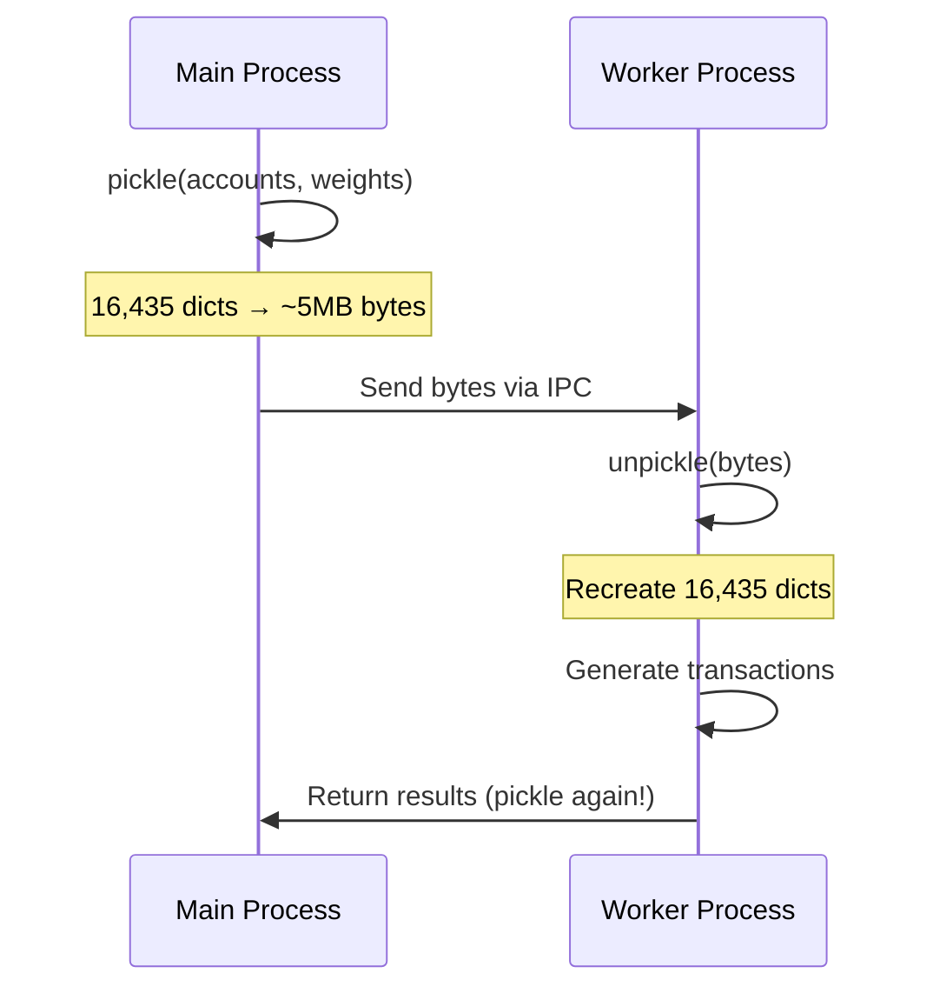
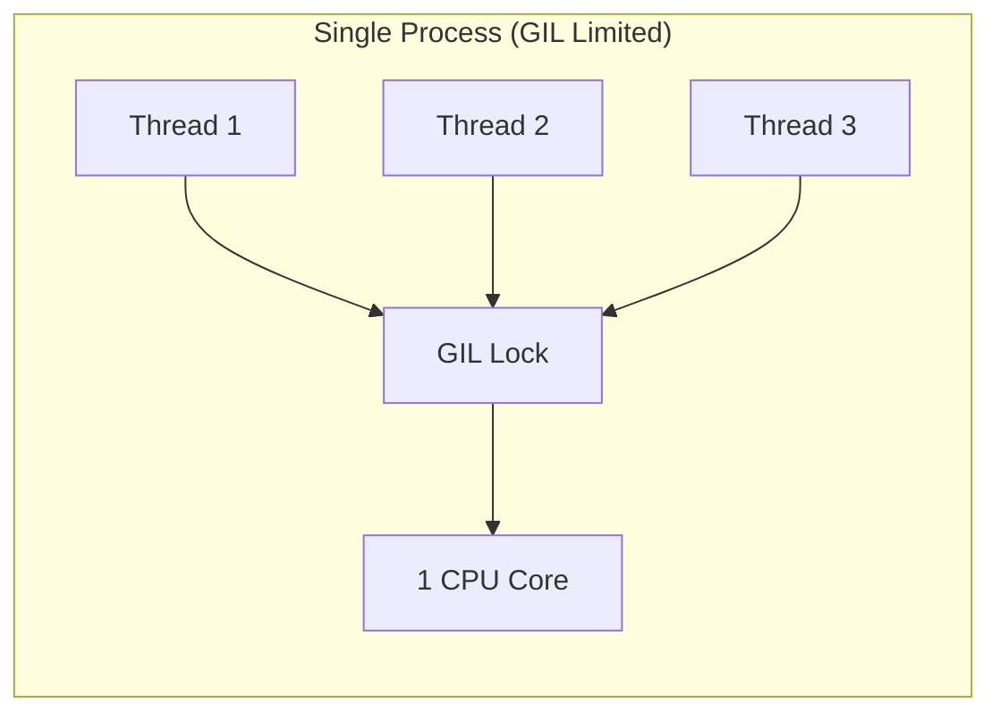
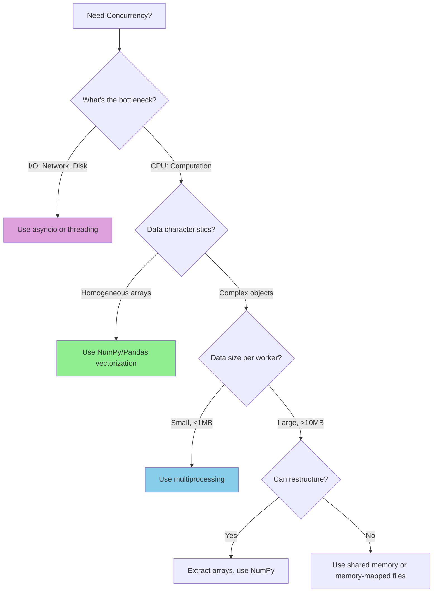

# Python Concurrency Deep Dive: Multiprocessing vs NumPy Vectorization

> **Context**: This document explains why our multiprocessing approach for generating 5M transactions was slow/hanging, and why NumPy vectorization solved it.

---

## The Problem We Encountered

When generating 5 million transactions, our `ProcessPoolExecutor` with 8 workers appeared to hang for 6+ minutes without progress. The CPU was busy, but no output was being produced.

```python
# Original slow approach
with ProcessPoolExecutor(max_workers=8) as executor:
    futures = executor.map(_generate_chunk, chunks)  # Hung here!
```

---

## Root Cause: Serialization Overhead

### What is Pickling?

**Pickle** is Python's built-in serialization protocol. When you send data between processes, Python must:

1. **Serialize (pickle)**: Convert Python objects → byte stream
2. **Transfer**: Send bytes through IPC (Inter-Process Communication)
3. **Deserialize (unpickle)**: Convert byte stream → Python objects



### The Math Doesn't Work

| Data | Size | × Workers |
|------|------|-----------|
| Accounts list | ~5 MB | × 8 = 40 MB |
| Account weights | ~0.5 MB | × 8 = 4 MB |
| Return: 625K transactions | ~100 MB | × 8 = 800 MB |

**Total serialization**: ~850 MB of data being pickled/unpickled!

---

## Key Concepts

### 1. Global Interpreter Lock (GIL)

The **GIL** is a mutex that protects access to Python objects, preventing multiple threads from executing Python bytecode simultaneously.



**Implications**:

- `threading` module = **limited by GIL** (only 1 thread runs Python at a time)
- `multiprocessing` module = **bypasses GIL** (separate Python interpreters)

### 2. CPU-Bound vs I/O-Bound

| Type | Bottleneck | Best Solution |
|------|------------|---------------|
| **I/O-Bound** | Waiting for disk, network, database | `threading` or `asyncio` |
| **CPU-Bound** | Heavy computation | `multiprocessing` or NumPy |

Our transaction generation is **CPU-bound** (random number generation, string formatting).

### 3. Inter-Process Communication (IPC)

When using `multiprocessing`, processes don't share memory. They communicate via:

- **Pipes** (default for `ProcessPoolExecutor`)
- **Queues**
- **Shared memory** (requires explicit setup)

```python
# Each chunk sent to worker = IPC overhead
chunks.append((accounts, weights, start, end, seed))
#              ^^^^^^^^  ^^^^^^^
#              ~5MB      ~0.5MB   × 8 workers = 44MB IPC!
```

---

## Why NumPy Vectorization is Faster

### Vectorization Explained

Instead of Python loops, NumPy performs operations on entire arrays at once using optimized C code.

```python
# Python loop: 5M iterations, GIL-limited
for i in range(5_000_000):
    result = random.choice(accounts, weights)

# NumPy vectorized: Single C operation, no GIL
result = np.random.choice(len(accounts), size=5_000_000, p=weights)
```

### Performance Comparison


| Approach | Time for 5M random choices |
|----------|----------------------------|
| Python `random.choices()` loop | ~30 seconds |
| NumPy `np.random.choice()` | ~0.5 seconds |

### No Serialization Needed

NumPy arrays stay in the **same process** - no pickle overhead!

```python
# All data stays in main process memory
account_indices = np.random.choice(...)  # Fast!
txn_types = np.random.randint(...)       # Fast!
amounts = np.random.uniform(...)         # Fast!

# Only the final loop builds dicts (necessary evil)
for i in range(n):
    transactions.append({...})  # Still fast, ~100K/sec
```

---

## When to Use Each Approach

### Use `multiprocessing` When

✅ Each worker needs **minimal input data**  
✅ Workers do **heavy computation** with little output  
✅ Tasks are **truly independent** (no shared state)  
✅ Input/output data is **small and simple** (numbers, strings)

```python
# Good use case: CPU-intensive calculation, small inputs
def compute_pi(iterations):
    # Heavy math, returns single float
    return estimate

with ProcessPoolExecutor() as executor:
    results = executor.map(compute_pi, [1e8, 1e8, 1e8, 1e8])
```

### Use NumPy Vectorization When

✅ Operations can be expressed as **array operations**  
✅ Data is **homogeneous** (all numbers, all same type)  
✅ Need to generate **large amounts of random data**  
✅ Want to avoid **serialization overhead**

```python
# Perfect for NumPy: Generate 5M random values
indices = np.random.choice(n, size=5_000_000, p=weights)
amounts = np.random.uniform(1000, 100000, size=5_000_000)
```

### Use `threading` or `asyncio` When

✅ Tasks are **I/O-bound** (network, disk, database)  
✅ Need to handle **many concurrent connections**  
✅ Want **lightweight concurrency** without process overhead

```python
# Good for I/O: Concurrent HTTP requests
async def fetch_all(urls):
    async with aiohttp.ClientSession() as session:
        return await asyncio.gather(*[fetch(session, url) for url in urls])
```

---

## Decision Flowchart



---

## Our Solution: Hybrid Approach

We combined the best of both worlds:

```python
def generate_transactions(accounts, n=5_000_000):
    # PHASE 1: NumPy for random generation (instant)
    account_indices = np.random.choice(len(accounts), size=n, p=weights)
    txn_types = np.random.randint(0, 7, size=n)
    amounts = np.random.uniform(50000, 100000000, size=n)
    timestamps = np.random.uniform(start_ts, end_ts, size=n)
    
    # PHASE 2: Python loop for dict creation (still fast)
    for i in range(n):
        transactions.append({
            "txn_id": f"TXN{i+1:06d}",
            "account_id": account_ids[account_indices[i]],
            ...
        })
```

**Result**: 5M transactions in ~2-3 minutes instead of 6+ minutes stuck.

---

## Key Takeaways

1. **Multiprocessing isn't always faster** - serialization can kill performance
2. **NumPy beats Python loops** by 10-100x for numerical operations
3. **Profile before optimizing** - the bottleneck isn't always obvious
4. **Choose the right tool**:
   - I/O-bound → asyncio/threading
   - CPU-bound + arrays → NumPy
   - CPU-bound + complex objects + small data → multiprocessing

---

## Further Reading

- [Python `concurrent.futures` Documentation](https://docs.python.org/3/library/concurrent.futures.html)
- [NumPy Performance Tips](https://numpy.org/doc/stable/user/quickstart.html)
- [Real Python: Speed Up Python with Concurrency](https://realpython.com/python-concurrency/)
- [Understanding the GIL](https://realpython.com/python-gil/)
